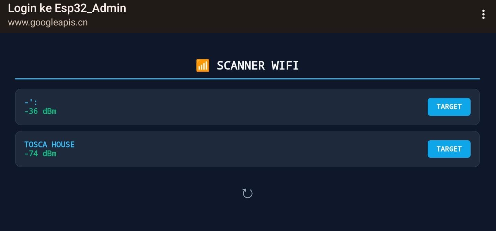
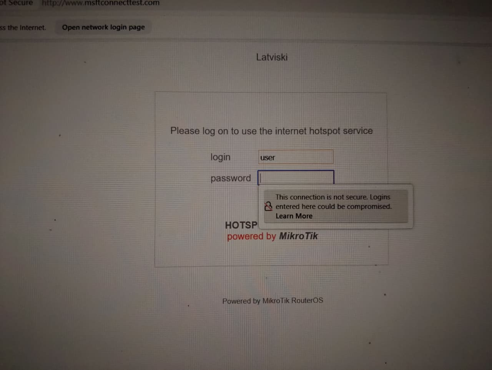

# 📡 ESP32 Advanced Wireless Auditor (Universal Evil Twin)

  
  
  

Repository ini berisi implementasi alat audit keamanan nirkabel berbasis ESP32 (WROOM-32U). Proyek ini dirancang untuk mensimulasikan serangan *Evil Twin Captive Portal* secara universal dengan fitur pemindaian jaringan real-time dan verifikasi kredenisial otomatis langsung ke router target.

---

## 📸 Antarmuka Sistem

| **C&C Admin Panel (Scanner)** | **Target View (Captive Portal)** |
|:---:|:---:|
|  |  |
| *Panel kontrol untuk memindai WiFi secara real-time.* | *Tampilan login MikroTik untuk validasi kredenisial.* |
---

## 🔥 Fitur Utama

| Fitur | Deskripsi | Logika Kerja |
| :--- | :--- | :--- |
| **📶 Universal Scanner** | Memindai SSID, BSSID, dan RSSI di sekitar secara real-time. | Menggunakan `WiFi.scanNetworks()` pada interval tertentu. |
| **🎯 Dynamic Evil Twin** | Otomatis meniru SSID dan konfigurasi target yang dipilih tanpa hardcode ulang. | Mengubah konfigurasi `softAP()` secara dinamis berdasarkan input. |
| **⚔️ Integrated Deauther** | Memutuskan koneksi pengguna asli agar terhubung ke portal audit. | Mengirim paket deauth melalui `esp_wifi_80211_tx()`. |
| **✅ Real-time Validation** | Memverifikasi password korban langsung ke router asli. | Mencoba koneksi via `WiFi.begin()` untuk cek validitas. |
| **↻ Smart Reset** | Menghentikan serangan dan kembali ke mode scan dengan satu klik. | Handler `/reset` mengembalikan status perangkat ke idle. |

---

🛠️ Alur Kerja (Proof of Concept)
Untuk memahami bagaimana alat ini bekerja, berikut adalah tahapannya:

Scanning: ESP32 memindai semua jaringan WiFi yang aktif di sekitar.

Selection: Melalui Panel Admin, pengguna memilih target SSID untuk dikloning.

Deauthentication: Alat mengirim paket deauth untuk memutuskan koneksi klien dari router asli.

Evil Twin & Captive Portal: ESP32 membuat akses poin palsu dengan nama yang sama. Saat target terhubung, portal login MikroTik akan muncul secara otomatis (Captive Portal).

Validation: Password yang dimasukkan target akan langsung diverifikasi ke router asli secara real-time sebelum dianggap valid.
---

## 🚀 Panduan Setup & Penggunaan

1.  **Struktur Gambar**: Buat folder `images` di repository dan upload file foto dengan nama `admin_scanner.jpg` serta `mikrotik_portal.jpg`.
2.  **Koneksi**: Nyalakan perangkat dan hubungkan ke WiFi **`Esp32_Admin`**.
3.  **Akses Panel**: Buka browser ke `192.168.4.1`.
4.  **Audit**: Pilih target dari daftar hasil scan, lalu klik **TARGET**.
5.  **Monitoring**: Pantau password yang masuk melalui Serial Monitor (Baud Rate: 115200).

---

## ⚠️ Disclaimer
*Proyek ini dikembangkan hanya untuk tujuan edukasi dan audit keamanan yang sah. Segala bentuk penyalahgunaan di luar lingkungan pengujian yang diizinkan adalah tanggung jawab pengguna sepenuhnya.*
